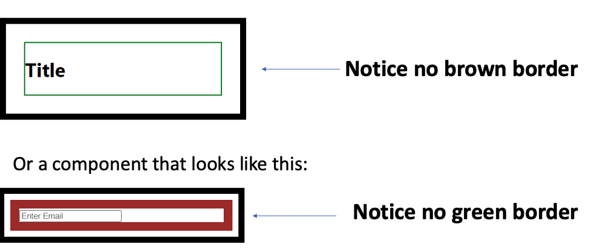

# 10. Pattern 1

## Question

- How can we edit the code so that we can remove or add one of the elements such as the div element that has brown border color or the div element with the green border color depending on our needs using composition pattern? Example, we need a component that looks like this:



## Solution

- Answer: Use composition pattern. A composition pattern is a design pattern that allows us to reuse the same component having the same design.

- Properties on the box.

```js
export default function Box(props) {
  return (
    <div
      style={{
        border: "10px solid black",
        width: "25vw",
        margin: "20px",
      }}>
      {props.children}
    </div>
  );
}
Box.GreenOutline = function BoxGreenOutline({ children }) {
  return (
    <div style={{ border: "2px solid green", margin: "30px" }}>{children}</div>
  );
};

Box.BrownOutline = function BoxBrownOutline({ children }) {
  return (
    <div style={{ border: "15px solid brown", margin: "10px" }}>{children}</div>
  );
};
```

```js
export default function One() {
  return (
    <Box>
      <Box.GreenOutline>Some content</Box.GreenOutline>
    </Box>
  );
}

function Two() {
  return (
    <Box>
      <Box.BrownOutline>
        <input placeholder="Enter Email" />
      </Box.BrownOutline>
    </Box>
  );
}

export default function Three() {
  return <Box>From Three</Box>;
}
```

## Composition Pattern

- https://medium.com/@ignatovich.dm/composition-vs-props-in-react-a-detailed-guide-f9034394cc7a

**What Are Props in React?**
Props (short for properties) are how data flows into a React component. They allow you to pass values and functions from a parent to a child component, facilitating customization and reuse.

**Key Characteristics of Props:**

- Immutable: Props cannot be modified within the child component.
- Unidirectional Data Flow: Props pass data from parent to child.
- Declarative Syntax: Props are defined in the parent and consumed in the child.

```js
function Greeting({ name }) {
  return <h1>Hello, {name}!</h1>;
}

function App() {
  return <Greeting name="Alice" />;
}
```

- Here, the Greeting component is reusable with different names simply by passing different values via the name prop.

**What Is Composition in React?**

- Instead of passing data down as props, you use components as children or props to achieve flexibility.

**Example of Composition**

- Flexible Component Structure: Allows passing JSX or components as children or props.

```js
function Card({ children }) {
  return <div className="card">{children}</div>;
}

function App() {
  return (
    <Card>
      <h1>Title</h1>
      <p>Content goes here.</p>
    </Card>
  );
}
```

- Here, the Card component doesn’t know or care what its children are, making it highly reusable and adaptable.

## Best Practices

- Keep Components Focused: Use props for data and composition for structure.
- Avoid Prop Drilling: Use context or composition to avoid deeply nested props.
- Favor Composition for Layouts: It simplifies reusable and flexible designs.
