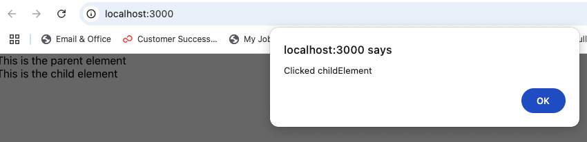
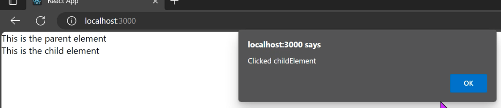

# 12. Event bubbling

## Question

- What is wrong with the code below? How to fix it?

```js
import React from "react";

function App() {
  function handleClick(event) {
    alert("Clicked " + event.target.id);
  }

  return (
    <div id="parentElement" onClick={handleClick}>
      This is the parent element
      <div id="childElement" onClick={handleClick}>
        This is the child element
      </div>
    </div>
  );
}
```

<hr />

## Solution

- We have an event bubbling problem. To fix use `stopPropagation()`.
- When clicking on This is child element text, the alert shows twice.
  
  

- Event bubbling is a process where an event triggered on the innermost element (in this case, the child element) **bubbles up through its ancestor elements** (in this case, the parent element) in the DOM hierarchy, triggering any event handlers that have been set on those ancestor elements. In our example:

1. You click on the child element with the id "childElement."
2. The onClick event handler for the child element is triggered first, which is the
   handleClick function.
3. After the handleClick function for the child element is executed, the event **continues to bubble up through the DOM hierarchy to the parent element.**
4. The onClick event handler for the **parent element is also triggered**, and the same handleClick function is called again with the event object representing the parent element.

- You can use the stopPropagation() method to stop the event from continuing to bubble up the DOM hierarchy when an event occurs on a child element.

- <b>So If child element is clicked and event.stopPropagation() is called, the event won't reach the parent element,and the event handler attached to the parent element won't be executed.</b>

```js
function App() {
  function handleClick(event) {
    event.stopPropagation();
    alert("Clicked " + event.target.id);
  }

  return (
    <div id="parentElement" onClick={handleClick}>
      This is the parent element
      <div id="childElement" onClick={handleClick}>
        This is the child element
      </div>
    </div>
  );
}
```

- The dialog appears twice.

  

  

## Summary

- event, bubble up
- event.stopPropagation();
