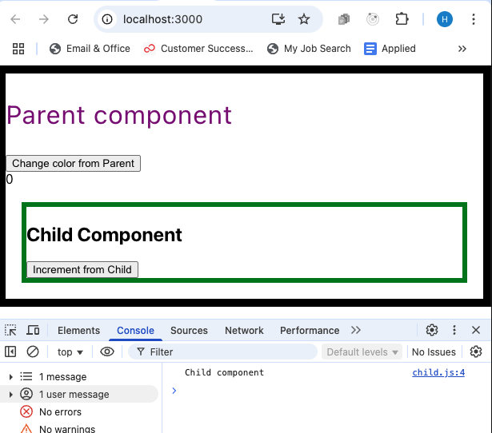
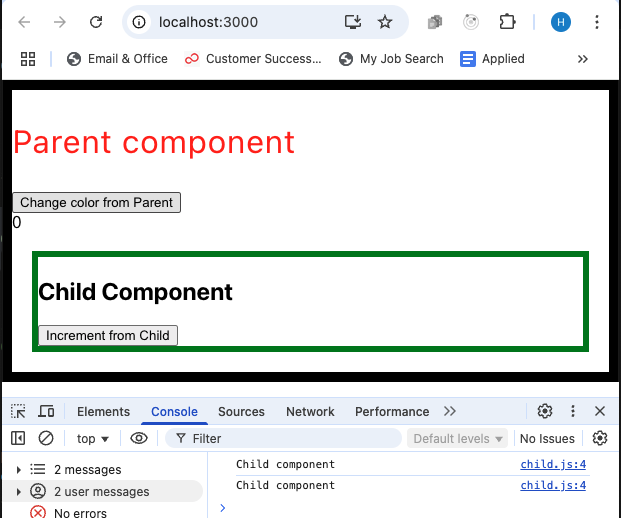
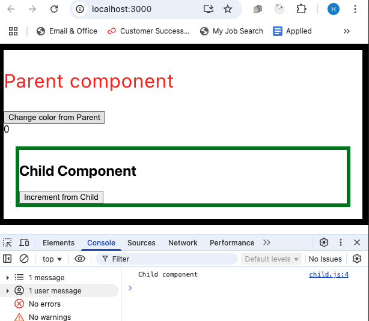

# Memo 1

## Problem

- How to prevent the child components from being re rendered when the button in the app component is clicked?

- In React, when you create a function inside a functional component, it's recreated every time the component renders. For example:

- In React when the state of a parent component changes, it triggers a re- render of the parent component and its children. This is because React follows a unidirectional data flow, where changes in the state or props of a parent component can affect the rendering of its child components.

```js
function App() {
  const [counter, setCounter] = useState(0);
  const [color, setColor] = useState("purple");

  function bigCalculation() {
    for (var i = 0; i < 1000000; i++) {}
    setCounter(counter + i);
  }

  return (
    <div style={{ border: "10px solid black" }}>
      <p style={{ color: `${color}`, fontSize: "2rem" }}>Parent component</p>
      <button onClick={() => setColor("red")}>Change color from Parent</button>
      <br />
      {counter}
      <Child bigCalculation={bigCalculation} />
    </div>
  );
}
```

## Solution

- Use `usecallback` AND the `memo hook`.
- `useCallback` hook and memo. useCallback hook means that do not recreate me(the function) unless my dependencies change.

- **memo** is a HOC to prevent a component from re-rendering unless its props have changed. memo will cause React to skip rendering a component if its props have not changed

- **useCallback** returns a memoized function.

```js
//---App.js
function App() {
  const [counter, setCounter] = useState(0);
  const [color, setColor] = useState("purple");

  const bigCalculation = useCallback(() => {
    for (var i = 0; i < 1000000; i++) {}
    setCounter(counter + i);
  }, [counter]);

  return (
    <div style={{ border: "10px solid black" }}>
      <p style={{ color: `${color}`, fontSize: "2rem" }}>Parent component</p>
      <button onClick={() => setColor("red")}>Change color from Parent</button>
      <br />
      {counter}

      <Child bigCalculation={bigCalculation} />
    </div>
  );
}

//---Child.js
function Child({ bigCalculation }) {
  console.log("Child component");
  return (
    <div style={{ border: "6px solid green", margin: "20px" }}>
      <h2>Child Component</h2>
      <button onClick={bigCalculation}>Increment from Child</button>
    </div>
  );
}
export default React.memo(Child);
```

- Use use callback and the memo hook.
- when the colored state changes, we do not rerender the child components, which saves us
  resources in the memory so we don't use more resources in the memory.

- So this is very good actually.

- So if I click on increment from child, of course we will see the child component because we are changing

the state here, the counter state.

## Reference

- https://react.dev/reference/react/useCallback
- useCallback is a React Hook that lets you cache a function definition between re-renders.
- `const cachedFn = useCallback(fn, dependencies)`
- Usage: 1) Skipping re-rendering of components. 2) Updating state from a memoized callback

- useCallback is a Hook, so you can only call it at the top level of your component or your own Hooks. You can’t call it inside loops or conditions. If you need that, extract a new component and move the state into it.

- **By default, when a component re-renders, React re-renders all of its children recursively.** This is why, when ProductPage re-renders with a different theme, the ShippingForm component also re-renders. This is fine for components that don’t require much calculation to re-render. But if you verified a **re-render is slow**, you can tell ShippingForm to skip re-rendering when its props are the same as on last render by wrapping it in memo:

```js
import { memo } from "react";

const ShippingForm = memo(function ShippingForm({ onSubmit }) {
  // ...
});
```

- https://react.dev/reference/react/memo
  - memo lets you skip re-rendering a component when its props are unchanged.

<hr />
- Default. Initialized the components
  


<hr />
- When the text color changed to red, Child component calls.
  


<hr />

- Fixed using useCallback().
  

# useCallback vs useMemo

```js
const cachedFn = useCallback(fn, dependencies);
const cachedValue = useMemo(calculateValue, dependencies);
```

- Performance optimization
- preventing unnecessary re-renders.
- useCallback memoizes a function,
- useMemo memoizes a value

**Key Differences:**

- useCallback memoizes the function itself, while useMemo memoizes the value returned by a function.
- useCallback is typically used when passing functions as props to child components to prevent re-renders.
- useMemo is typically used when you have **expensive calculations** that you want to avoid recomputing unnecessarily.

**Troubleshoot**

- https://react.dev/reference/react/useCallback#troubleshooting

BEFORE

```js
function ProductPage({ productId, referrer }) {
  const handleSubmit = useCallback((orderDetails) => {
    post('/product/' + productId + '/buy', {
      referrer,
      orderDetails,
    });
  }); // 🔴 Returns a new function every time: no dependency array
```

AFTER

```js
function ProductPage({ productId, referrer }) {
  const handleSubmit = useCallback((orderDetails) => {
    post('/product/' + productId + '/buy', {
      referrer,
      orderDetails,
    });
  }, [productId, referrer]); // ✅ Does not return a new function unnecessarily
```
