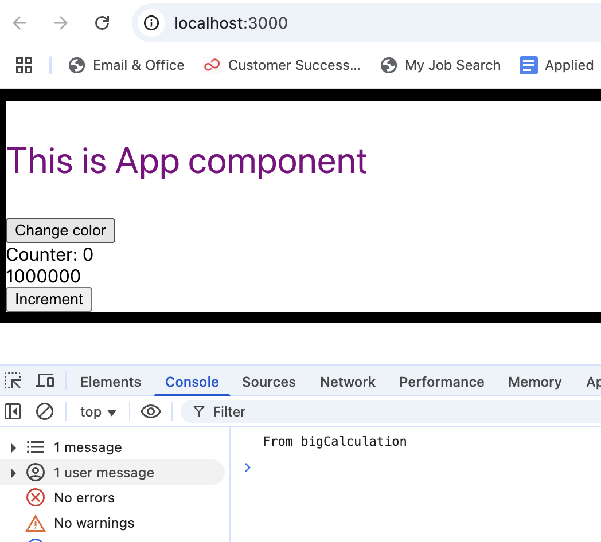
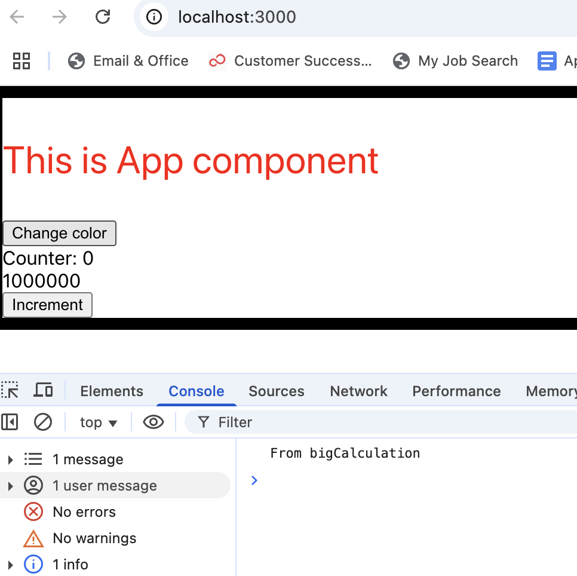
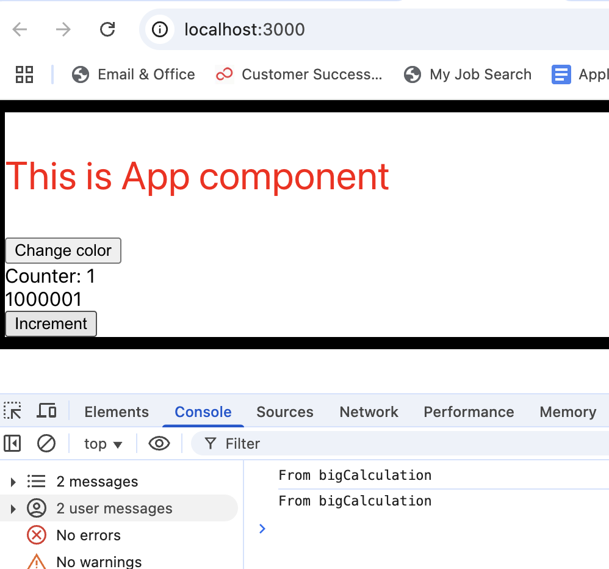

# Memo 2

## Problem

- If this button is clicked, we see that the text is changing from purple to red color, and we see from big calculation on line eight, which means that this calculation function runs after we change the color of this text by clicking on the button.

```js
function App() {
  const [counter, setCounter] = useState(0);
  const [color, setColor] = useState("purple");

  function bigCalculation() {
    console.log("From bigCalculation");
    var result = 0;
    for (var i = 0; i < 1000000; i++) {
      result += 1;
    }
    return counter + result;
  }

  function increase() {
    setCounter((counterValue) => counterValue + 1);
  }

  return (
    <div style={{ border: "10px solid black" }}>
      <p style={{ color: `${color}`, fontSize: "2rem" }}>
        This is App component
      </p>
      <button onClick={() => setColor("red")}>Change color</button>
      <br />
      Counter: {counter}
      <br />
      {bigCalculation()}
      <br />
      <button onClick={increase}>Increment</button>
    </div>
  );
}
```

## Solution

- When you use the useMemo hook, it helps recreation of the memoized value. This will save memory resources.

- If the dependencies provided in the dependency array (the second argument of useMemo) have not changed since the last render, React will reuse the previously memoized(cached) result instead of recomputing it.

- <h1>useMemo returns a value.</h1>

```js
import React, { useState } from "react";
function App() {
  const [counter, setCounter] = useState(0);
  const [color, setColor] = useState("purple");

  /*
  1)When the App component runs for the first time the useMemo hook is run and the loop is performed and a value
  returned which will be equal to  calculationResult. So calculationResult will be a memoized value not a function.

  2)If the first button is clicked to change the text color, the useMemo hook will not run again because it has a dependency
  that is "counter" and changing the text color does not change the counter state variable so useMemo will not run after the
  component re-renders to change the text color.This is good so we do not perform the big loop when we don't need to.

  3)If the second button is clicked to increase the counter, the useMemo hook runs.

  As a result, when using useMemo,unnecessary instances of functions or values are not created after each re-render.
  */

  //the second parameter in useMemo hook is the dependency, the calculationResult value will only change if its dependencies change
  const calculationResult = useMemo(() => {
    console.log("From bigCalculation");
    var result = 0;
    for (var i = 0; i < 1000000; i++) {
      result += 1;
    }
    return counter + result;
  }, [counter]);

  //running increase will change the counter so useMemo hook will run
  function increase() {
    setCounter((counterValue) => counterValue + 1);
  }

  return (
    <div style={{ border: "10px solid black" }}>
      <p style={{ color: `${color}`, fontSize: "2rem" }}>
        This is App component
      </p>
      <button onClick={() => setColor("red")}>Change color</button>
      <br />
      Counter: {counter}
      <br />
      {calculationResult}
      <br />
      <button onClick={increase}>Increment</button>
    </div>
  );
}
```

## References:

- https://react.dev/reference/react/useMemo
- **useMemo** is a React Hook that lets you cache the result of a calculation between re-renders.
- `const cachedValue = useMemo(calculateValue, dependencies)`
- `const cachedValue = useMemo(calculateValue, dependencies)`
- Usage - 1: Skipping expensive recalculations

```js
import { useMemo } from "react";

function TodoList({ todos, tab, theme }) {
  const visibleTodos = useMemo(() => filterTodos(todos, tab), [todos, tab]); //!!!useMemo returns a value.!!!!!
  // ...
}
```

**You need to pass two things to useMemo:**

- To cache a calculation between re-renders, wrap it in a useMemo call at the top level of your component:
- A calculation function that takes no arguments, like () =>, and returns what you wanted to calculate.
- A list of dependencies including every value within your component that’s used inside your calculation.
- On the initial render, the value you’ll get from useMemo will be the result of calling your calculation.

<hr />
The text is in puple as default.



<hr />

Purple to Red -> make sure bigCalculation doesn't call.



<hr />

bigCalculation called when counter state changes.


