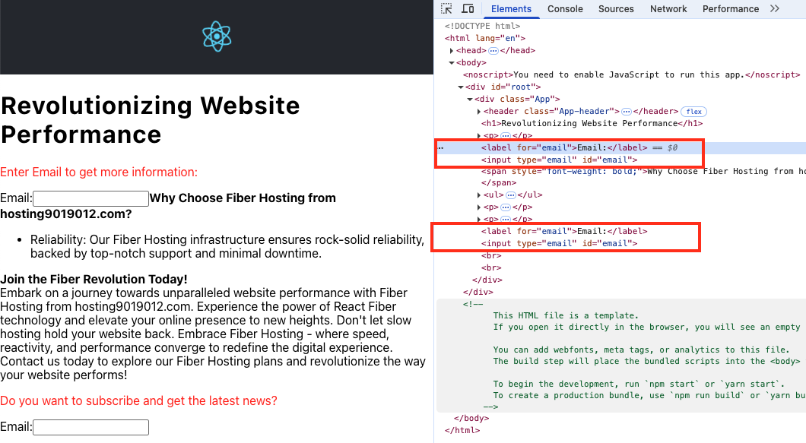
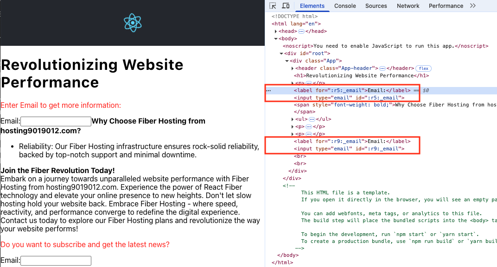

# Unique IDs

### Problem

- If we click on **the label for the second email** the first email input is focused because they both have the same id.

//App.js

```js
function App() {
  return (
      <p>
        <span style={{ color: "red" }}>
          Enter Email to get more information:
        </span>
      </p>
      <Email />
      <p>
        <span style={{ color: "red" }}>
          Do you want to subscribe and get the latest news?
        </span>
      </p>
      {/* If we click on the label for this email the first email input is focused because they both have the same id */}
      <Email />
  )}
```

//Email.js

```js
function Email() {
  return (
    <>
      <label htmlFor="email">Email:</label>
      <input type="email" id="email" />
    </>
  );
}
```

## Solution

```js
import { useId } from "react";

function Email() {
  const id = useId();

  return (
    <>
      <label htmlFor={`${id}_email`}>Email:</label>
      <input type="email" id={`${id}_email`} />
      <br />
      <br />

      <label htmlFor={`${id}_username`}>UserName:</label>
      <input type="email" id={`${id}_username`} />
    </>
  );
}
```

## References

- https://react.dev/reference/react/useId
  `const id = useId()`
- **Pitfall**: Do not call useId to generate keys in a list. Keys should be generated from your data.

## Screenshots



<hr />


