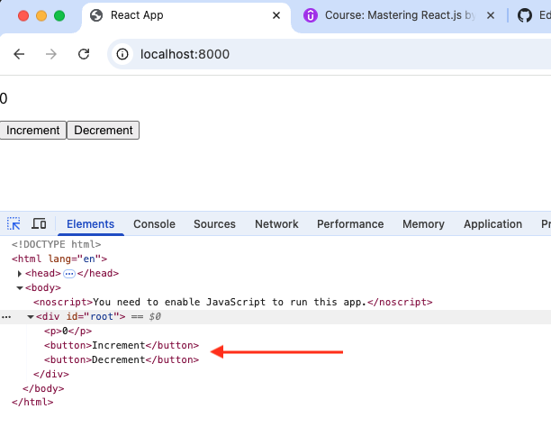

# SSR

### Run the demo

```
npm run build //build first because Node.js app is used build/index.html file.
npm run ssr
localhost:8000
```

### Code (Server-side)

1. server.js is the simple Node.js application.
2. the file is imported App.js which is JSX.
3. we imported a react component into a Node.js file. (Bable is working on it.)

```js
//server/server.js
import App from "../src/App";

const PORT = 8000;

const app = express();

app.use("^/$", (req, res, next) => {
  fs.readFile(path.resolve("./build/index.html"), "utf-8", (err, data) => {
    //
    if (err) {
      console.log(err);
      return res.status(500).send("Some error happened");
    }
    return res.send(
      data.replace(
        '<div id="root"></div>',
        `<div id="root">${ReactDOMServer.renderToString(<App />)}</div>`
      )
    );
  });
});
```



### Code (frontend)

**index.js**

- `hydrateRoot` lets you display React components inside a browser DOM node whose HTML content was previously rendered/generated by react-dom/server.

```js
import ReactDOM from "react-dom/client";
ReactDOM.hydrateRoot(document.getElementById("root"), <App />);
```

- https://react.dev/reference/react-dom/client/hydrateRoot
- hydrateRoot lets you display React components inside a browser DOM node whose HTML content was previously generated by react-dom/server.

<hr />

# Udemy

## Problems with Client side rendering

- **Performance**: Users need to download and execute the JavaScript to be able to view the page.
- **SEO**: Web crawlers might not wait long enough for client side waterfalls to finish.
- **Data Fetching**: The data requirements would be dependent on client’s network conditions.

## Solution

- With SSR, the server renders the react application and when a request

## Reference

- https://react.dev/reference/react-dom/client/hydrateRoot
- https://react.dev/reference/react-dom/server/renderToString
