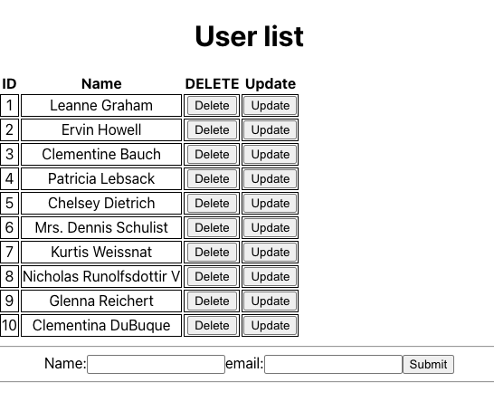
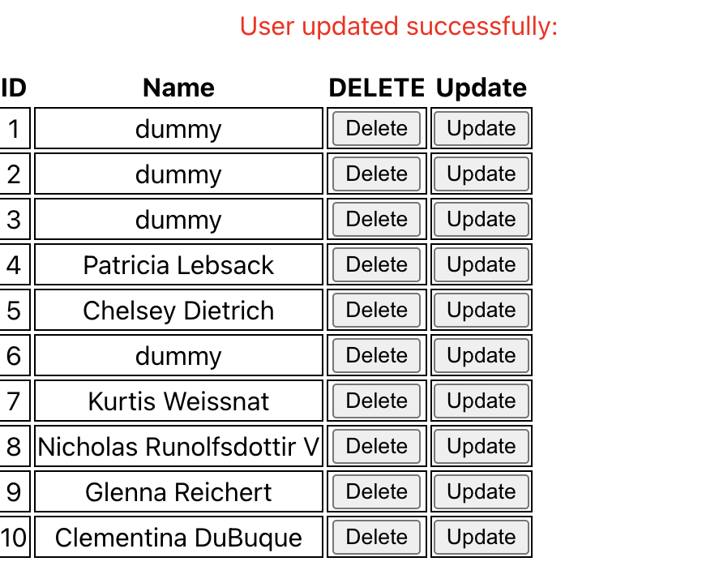
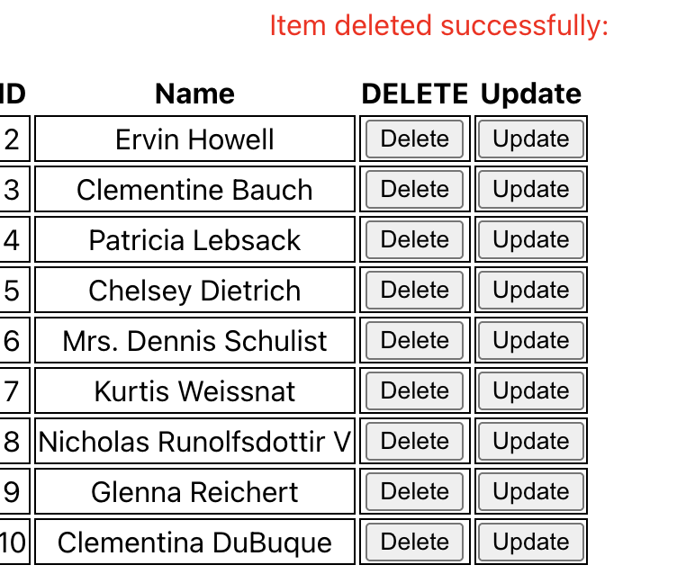

# RESTful demo with fetch API

```js
useEffect(()=>{}, [])
// Method #1 - Use .then
fetch(url).then(response=>{}).then(data=>{}).catch(error=>{})
======
fetch(url) -> response
!response.ok -> new Error()
response.json() -> data
=====
// Method #2 - Use async/await
const getData = async() =>{try().catch().finally()}
const response = await fetch(url)
const data = await response.json()
```

- [UsersView.js](./src/features/users/UsersView.jsx)
  

## GET

```js
export const UsersView = () => {
  const [users, setUsers] = useState([]);
  const [loading, setLoading] = useState(true);
  const [error, setError] = useState(null);

  useEffect(() => {
    fetch(url)
      .then((response) => {
        if (!response.ok) throw new Error("Failed to get users data.");
        return response.json();
      })
      .then((data) => {
        setUsers(data);
      })
      .catch((e) => {
        setError(e);
      })
      .finally(() => {
        setLoading(false);
      });
  }, []);
};
```



## POST

```js
export const UsersView = () => {
  const [users, setUsers] = useState([]);
  const [loading, setLoading] = useState(true);
  const [error, setError] = useState(null);
  const [name, setName] = useState("");
  const [email, setEmail] = useState("");

  const handleSubmit = async (event) => {
    event.preventDefault();
    setLoading(true);
    fetch("https://jsonplaceholder.typicode.com/users", {
      method: "POST",
      headers: {
        "Content-Type": "application/json",
      },
      body: JSON.stringify({ name, email }),
    })
      .then((response) => response.json())
      .then((data) => {
        setUsers([...users, data]);
        setName("");
        setEmail("");
      })
      .catch((error) => {
        setError(error);
      })
      .finally(() => {
        setLoading(false);
      });
  };
};
```


## PUT

- Update user name to "dummy"

```js
export const UsersView = () => {
  const [users, setUsers] = useState([]);
  const [loading, setLoading] = useState(true);
  const [error, setError] = useState(null);

  const handleUpdate = (id) => {
    const user = users.find((user) => user.id === id);
    fetch(`https://jsonplaceholder.typicode.com/users/${id}`, {
      method: "PUT",
      headers: { "Content-Type": "application/json" },
      body: JSON.stringify({ ...user, name: "dummy" }),
    })
      .then((response) => {
        if (!response.ok) throw new Error("");
        return response.json();
      })
      .then((data) => {
        setMessage("User updated successfully:");
        setUsers((values) =>
          values.map((item) => (item.id === id ? data : item))
        );
      })
      .catch((e) => {
        setError(e);
      })
      .finally(() => {
        setLoading(false);
      });
  };
};
```

- 

## DELETE

```js
const handleDelete = (id) => {
  fetch(`https://jsonplaceholder.typicode.com/users/${id}`, {
    method: "DELETE",
  })
    .then((response) => {
      if (!response.ok) throw new Error("");
      return response.json();
    })
    .then((data) => {
      setMessage("Item deleted successfully:");
      setUsers((values) => values.filter((item) => item.id !== id));
    })
    .catch((e) => {
      setError("Delete failed");
      console.log(e);
    })
    .finally(() => {
      setLoading(false);
    });
};
```



<hr />

## Custom Hook - useFetch

```js
import { useState, useEffect } from "react";

function useFetch(url, options) {
  const [data, setData] = useState(null);
  const [loading, setLoading] = useState(true);
  const [error, setError] = useState(null);

  useEffect(() => {
    setLoading(true);
    fetch(url, options)
      .then((response) => {
        if (!response.ok) {
          throw new Error(`HTTP error! status: ${response.status}`);
        }
        const data = response.json();
        return data;
      })
      .then((data) => {
        setData(data);
      })
      .catch((error) => {
        console.log(error);
        setError(error);
      });
    setLoading(false);
  }, [url]);
  return { data, loading, error };
}
export default useFetch;
```

## References:

- https://dev.to/collegewap/react-fetch-example-getpostputdelete-with-api-3l00
- https://stackoverflow.com/questions/62613709/implement-usefetch-react-hook-to-work-inside-submit-function
