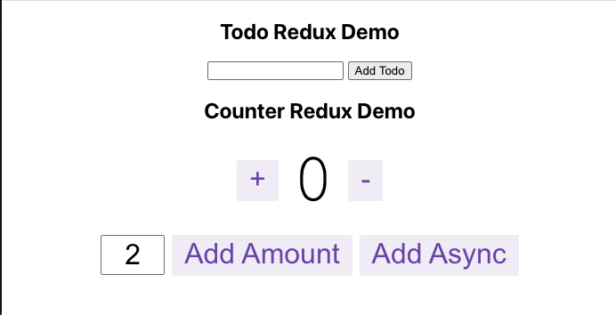
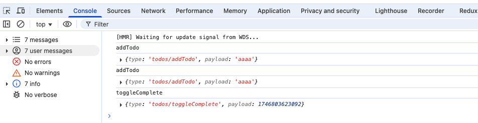

# Redux Toolkit Quick Start

- https://redux-toolkit.js.org/tutorials/quick-start
- [redux quick start repo](https://github.com/reduxjs/redux-essentials-counter-example/tree/master)
- [Todo sample](https://medium.com/@kmraman11011/title-building-a-todo-app-with-react-and-redux-toolkit-5ae2740048c3)
<hr />

```js
import { configureStore, createSlice } from "@reduxjs/toolkit";
import { Provider, useSelector, useDispatch } from "react-redux";
import ReactDOM from "react-dom";

const store = configureStore({reducer:{}})
const todoSlice = createSlice({name: xxx, initialState: {todo:[]}, reducers: {add:(state,action)=>{}}})
export const {func1, func2} = todoSlice.actions
export default todorSlice.reducer
const todo = useSelector((state) => state.todos.todo)
const dispatch = useDispatch()
onClick={() => deleteTodo(data.id)}
onClick={dispatch(addTodo())}

ReactDOM.render(<Provider store={store}><App /></Provider>,document.getElementById("root"));
```

1. Create a Redux Store
2. Provide the Redux Store to React
3. Create a Redux State Slice
4. Add Slice Reducers to the Store
5. Use Redux State and Actions in React Components

Code

```js
//store.js
export default configureStore({
  reducer: {
    counter: counterReducer,
    todos: todoReducer,
  },
});

//index.js
import React from "react";
import ReactDOM from "react-dom";
import App from "./App";
import store from "./app/store";
import { Provider } from "react-redux";

ReactDOM.render(
  <Provider store={store}>
    <App />
  </Provider>,
  document.getElementById("root")
);

//counterSlice.js
import { createSlice } from "@reduxjs/toolkit";

export const counterSlice = createSlice({
  name: "counter",
  initialState: {
    value: 0,
  },
  reducers: {
    increment: (state) => {
      state.value += 1;
    },
    decrement: (state) => {
      state.value -= 1;
    },
    incrementByAmount: (state, action) => {
      state.value += action.payload;
    },
  },
});
export const { increment, decrement, incrementByAmount } = counterSlice.actions;
export default counterSlice.reducer;

//todoSlice.js
import { createSlice } from "@reduxjs/toolkit";

const todoSlice = createSlice({
  name: "todos",
  initialState: { todo: [] },
  reducers: {
    addTodo: (state, action) => {
      state.todo.push({
        id: Date.now(),
        text: action.payload,
        completed: false,
      });
    },
    completeTodo: (state, action) => {
      const todo = state.todo.find((todo) => todo.id === action.payload);
      todo.completed = true;
    },
    deleteTodo: (state, action) => {
      const index = state.todo.findIndex((todo) => todo.id === action.payload);
      if (index !== -1) {
        state.splice(index, 1);
      }
    },
  },
});
export const { addTodo, toggleComplete, deleteTodo } = todoSlice.actions; ///???
export default todoSlice.reducer;

///Counter.js
import React, { useState } from 'react';
import { useSelector, useDispatch } from 'react-redux';
import {
  decrement,
  increment,
} from './counterSlice';

export function Counter() {
  const count = useSelector(selectCount);
  const dispatch = useDispatch();

  return (
    <div>
        <button onClick={() => dispatch(increment())}>+</button>
        <span className={styles.value}>{count}</span>
        <button onClick={() => dispatch(decrement())}>-</button>
    </div>
    )
}

//Todo.js
export const Todo = () => {
  const [text, setText] = useState("");
  const todos = useSelector((state) => state.todos.todo);
  const dispatch = useDispatch();

  const handleInputChange = (e) => {
    setText(e.target.value);
  };

  const handleAddTodo = () => {
    if (text) {
      dispatch(addTodo(text));
      setText("");
    }
  };

  return (
    <div>
      <input type="text" value={text} onChange={handleInputChange} />{" "}
      <button onClick={handleAddTodo}> Add Todo </button>{" "}
      <ul>
        {todos.map((todo) => (
          <li
            key={todo.id}
            style={{
              textDecoration: todo.completed ? "line-through" : "none",
            }}>
            {todo.text}{" "}
            <button onClick={() => dispatch(completeTodo(todo.id))}>
              {todo.completed ? "Mark Incomplete" : "Mark Complete"}{" "}
            </button>{" "}
            <button onClick={() => dispatch(deleteTodo(todo.id))}>
              Delete
            </button>{" "}
          </li>
        ))}
      </ul>
    </div>
  );
};
```

## Summary

**Create a Redux store with configureStore**

- `configureStore` accepts a `reducer` function as a named argument
- `configureStore` automatically sets up the store with good default settings

**Provide the Redux store to the React application components**

- Put a React-Redux `<Provider>` component around your `<App />`.
- Pass the Redux store as `<Provider store={store}>`.

**Create a Redux "slice" reducer with createSlice**

- Call `createSlice` with a string name, an initial state, and named reducer functions
- Reducer functions may "mutate" the state using Immer
- Export the generated slice reducer and action creators

**Use the React-Redux `useSelector/useDispatch` hooks in React components**

- Read data from the store with the `useSelector` hook
- Get the `dispatch` function with the `useDispatch` hook, and dispatch actions as needed

## What is Redux?

A:
The strength of Redux itself is that it creates a data flow outside of your components. Your components just dispatch an event, and logic outside the component happens. Your component later gets a new state and displays it.

- https://stackoverflow.com/questions/70136955/is-redux-thunk-middleware-really-needed-in-a-react-hooks-based-app

- [Redux Toolkit vs. TanStack Query: Which Should You Use?](https://medium.com/@andrew.chester/redux-toolkit-vs-tanstack-query-which-should-you-use-3f22ffe29820)

## Demo

```js
npm start
```



<hr />



## Others

- [What is the difference between onClick handler approach](https://stackoverflow.com/questions/76520889/what-is-the-difference-between-onclick-handler-approach)

```js
<button onClick={handleChange}>Change Text</button>
<button onClick={() => handleChange()}>Change Text</button>
```

Both will work, and in this case, both will functionally be pretty much the same.

In your first example, you're directly passing the function reference to onClick

`<button onClick={handleChange}>Change Text</button>`
In your second example, you're passing an anonymous function to onClick. When called, that anonymous function calls handleChange

`<button onClick={() => handleChange()}>Change Text</button>`
Unless you're getting some parameters passed to handleChange that you don't want to, I'd suggest not wrapping it in an anonymous function like your second example. There's no benefit to it. It's just overhead.
